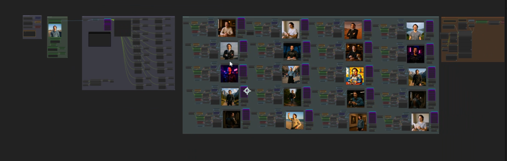

# Single Image to LoRA - ComfyUI Workflow

Automated ComfyUI workflow that creates a custom LoRA model from just one reference image.

## How It Works

1. **LLM Prompt Generation**: Gemini analyzes your image and generates 20 diverse prompts
2. **Image Generation**: FLUX.1 Kontext creates 20 consistent variations using those prompts
3. **Dataset Creation**: Images are automatically saved with caption files
4. **LoRA Training**: Integrated training directly in ComfyUI

## Setup

### Required Custom Nodes
Install via ComfyUI Manager:
- `ComfyUI-Impact-Pack`
- `WAS Node Suite`
- `ComfyUI_Fill-Nodes`
- `ComfyUI-KJNodes`
- `comfyui_tinyterranodes`
- `ComfyUI-FluxTrainer`
- `ComfyUI-SP-Nodes`
- `ComfyUI-Custom-Scripts`

### Required Models
- FLUX.1 Kontext model (`flux1-dev-kontext_fp8_scaled.safetensors`)
- FLUX VAE (`ae.safetensors`)
- FLUX CLIP encoders (`clip_l.safetensors`, `t5xxl_fp8_e4m3fn_scaled.safetensors`)
- Training models (`flux1-dev.safetensors`, `t5xxl_fp16.safetensors`)

## Usage

1. Load the `workflow.json` file into ComfyUI
2. Connect your reference image to the Load Image node
3. Set your Gemini API key in the FL_GeminiVideoCaptioner node
4. Configure:
   - **Trigger word**: Unique word for your LoRA
   - **Folder name**: Where to save dataset and LoRA
   - **Output path**: Path to ComfyUI output directory
5. Run the workflow

Your trained LoRA will be saved in the specified folder.

## Links

- [Black Forest Labs](https://bfl.ai/)
- [FLUX.1 Kontext Paper](https://arxiv.org/pdf/2506.15742)